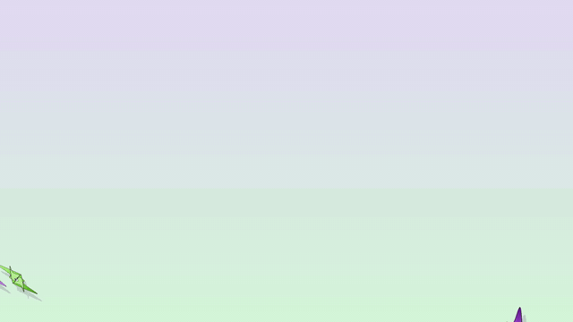
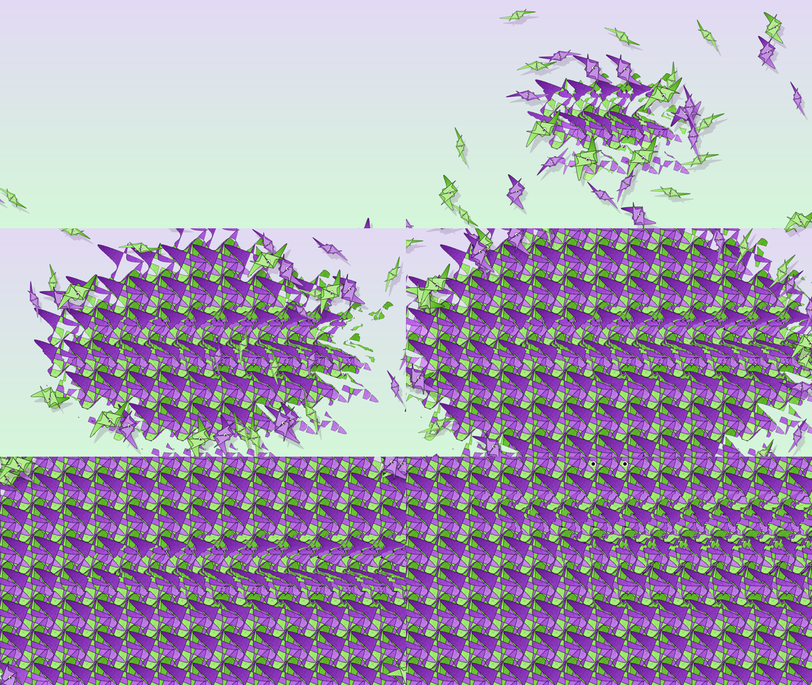
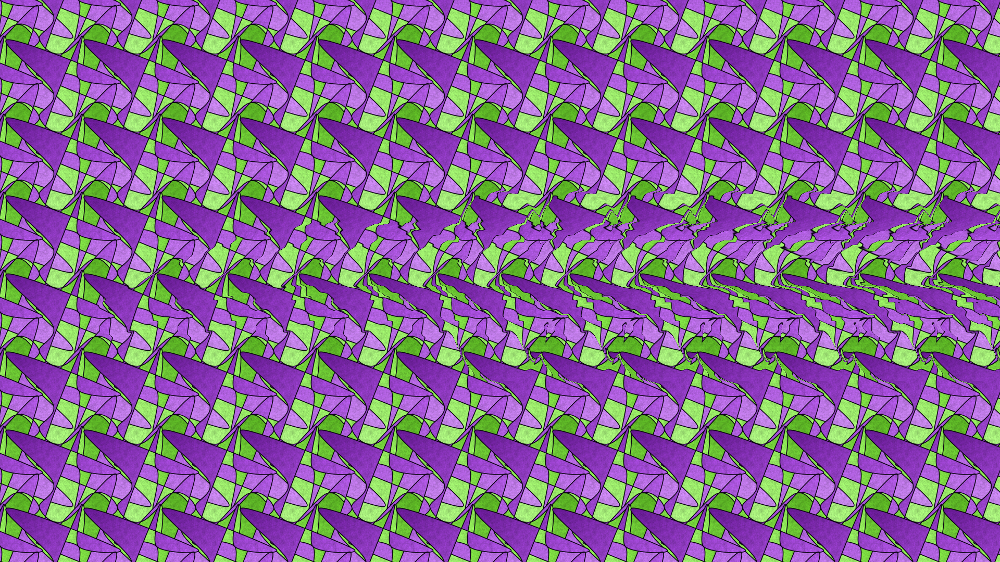
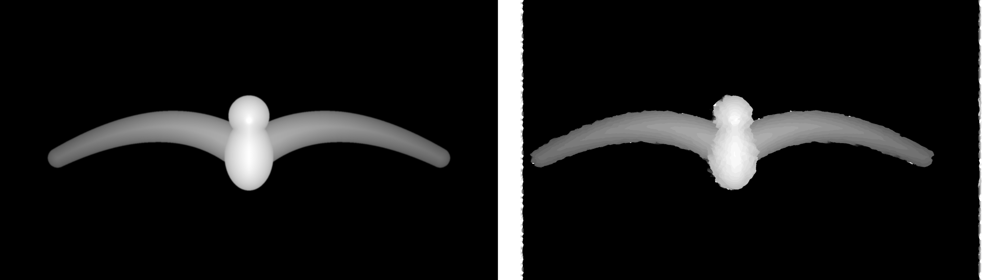
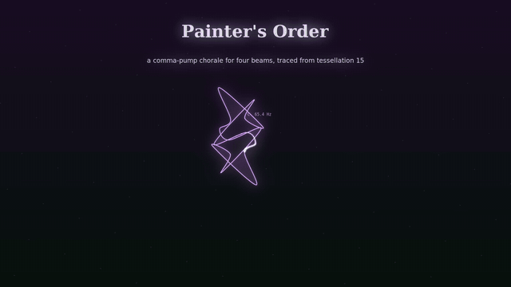
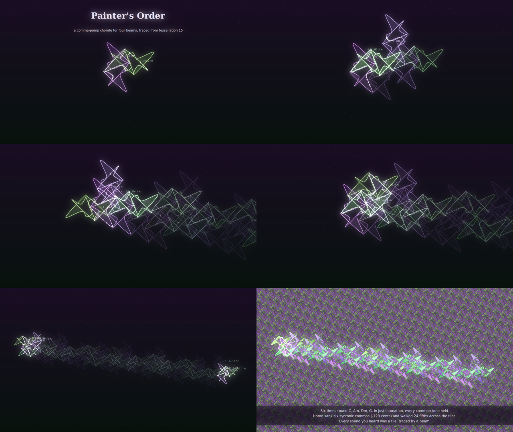

# InverseCramer

Two short films made from one source drawing, `canon/tessellation_15.svg`. Each film is rendered twice: once in a
Claude cloud container and once entirely by GitHub Actions, from the same code.

| Piece | What it is | Run locally | Run on GitHub |
|---|---|---|---|
| **Flock** | Paper swifts flutter in and land as a Magic Eye stereogram that hides a front-on gull with spread wings. Score: an original miniature in a Tchaikovsky manner (B minor, oboe, tremolo strings, harp, celesta). | `flock/run_all.sh build/flock 4` | Actions → **flock** → Run workflow |
| **Painter's Order** | A four-beam oscilloscope chorale. Each voice traces the tile outline as its waveform; the lattice is read as a just-intonation Tonnetz; a comma pump walks the music across the tiles and then fills them in. | `painters_order/run_all.sh build/painters_order 4` | Actions → **painters-order** → Run workflow |

GitHub results are committed to the `renders` branch under `gh/<piece>/`; cloud results are in `dist/cloud/<piece>/`.

**▶ Website:** https://meefs.github.io/InverseCramer/ : both films, the live Magic Eye viewer, and a playable **tile organ**
(click the lattice to hear the tile traced as sound; Space plays the comma pump). Source in `site/`, deployed by
`.github/workflows/pages.yml`; refresh it from new renders with `site/build.sh`.

## The results

### Flock: a Magic Eye made of paper swifts
[](dist/cloud/flock/flock.mp4)

▶ **[Play Flock (MP4, 42 s, with sound)](dist/cloud/flock/flock.mp4)**. The loop above is a silent 2× preview of the fly-in.



| Finished stereogram (view wall-eyed at 1:1 pixels) | Hidden depth vs what the decoder recovered |
|---|---|
|  |  |

- Score: original, in a Tchaikovsky manner, B minor. Lighter web encode: [`site/media/flock.mp4`](site/media/flock.mp4) (17 MB)
- Interactive viewer: [`dist/cloud/flock/flock_viewer.html`](dist/cloud/flock/flock_viewer.html). Download it and open it
  in a browser, then set the repeat slider for your screen.
- QA: the decoder recovers the gull with an edge-tolerant F-score of 0.909 (gate 0.90).

### Painter's Order: a comma-pump chorale for four beams
[](dist/cloud/painters_order/painters_order.mp4)

▶ **[Play Painter's Order (MP4, 58 s, with sound)](dist/cloud/painters_order/painters_order.mp4)**. The loop above is a
silent, sped-up preview of the walk and the final reveal.



- Lighter web encode: [`site/media/painters-order.mp4`](site/media/painters-order.mp4) (14 MB)
- Every sound is the tile outline traced as an oscilloscope beam. Six rounds of C–Am–Dm–G in just intonation sink home
  by six syntonic commas (−129 cents) and walk the chorale 24 fifths across the tessellation.

### Cloud vs GitHub Actions
| | Cloud container | GitHub Actions |
|---|---|---|
| Flock, wall time | 2 min 51 s | 3 min 47 s (5 jobs in parallel) |
| Painter's Order, wall time | 6 min 24 s | 4 min 34 s (8 frame runners) |
| Outputs | [`dist/cloud/`](dist/cloud) | [`renders` branch, `gh/`](../../tree/renders/gh) |

The stereogram, the depth map and both soundtracks come out **byte-identical** on both platforms (SHA-256 in each
`checksums.txt`). The runtimes, what happened on each front and how to speed up the next run are in
**[REPORT.md](REPORT.md)**.

## What the SVG turned out to be
- One prototile (16 cubic Béziers) placed 964 times, in four 90° rotations, one colour each, sharing a pivot (wallpaper group p4).
- A square lattice of 83.07 px, tilted 22°.
- The outline **crosses itself**, so neighbouring tiles overlap and the *draw order* decides what is visible. The SVG is
  drawn outward from the centre, which is why the screen capture shows four different-looking regions. Painting in a
  translation-invariant order (colour class, then position along a fixed direction) gives a truly periodic pattern.
- Traced as a waveform, the outline has 180° point symmetry, so it contains **only odd harmonics** (clarinet-like),
  and nothing above the 11th.

## Layout
```
canon/            the source SVG
refs/             the brief documents and the screen capture
common/tess.py    geometry read from the SVG (lattice, classes, Bézier trace)
common/synth.py   NumPy orchestra and hall reverb (no samples)
flock/            pattern cell, gull depth, stereogram + QA decoder, fly-in, score, viewer
painters_order/   Tonnetz comma pump, scope audio, glowing-beam film
.github/          setup + publish composite actions, one workflow per piece
```

## Requirements
Python 3.11+ with `pip install -r requirements.txt`, plus ffmpeg, the Cairo library and DejaVu fonts
(`apt-get install ffmpeg libcairo2 fonts-dejavu-core`; on macOS `brew install ffmpeg cairo`).

## QA
`flock.still` decodes its own stereogram (per-row block matching) and compares the recovered depth with the gull.
It exits non-zero below an edge-tolerant F-score of 0.90, which fails the GitHub job before any frames render.
